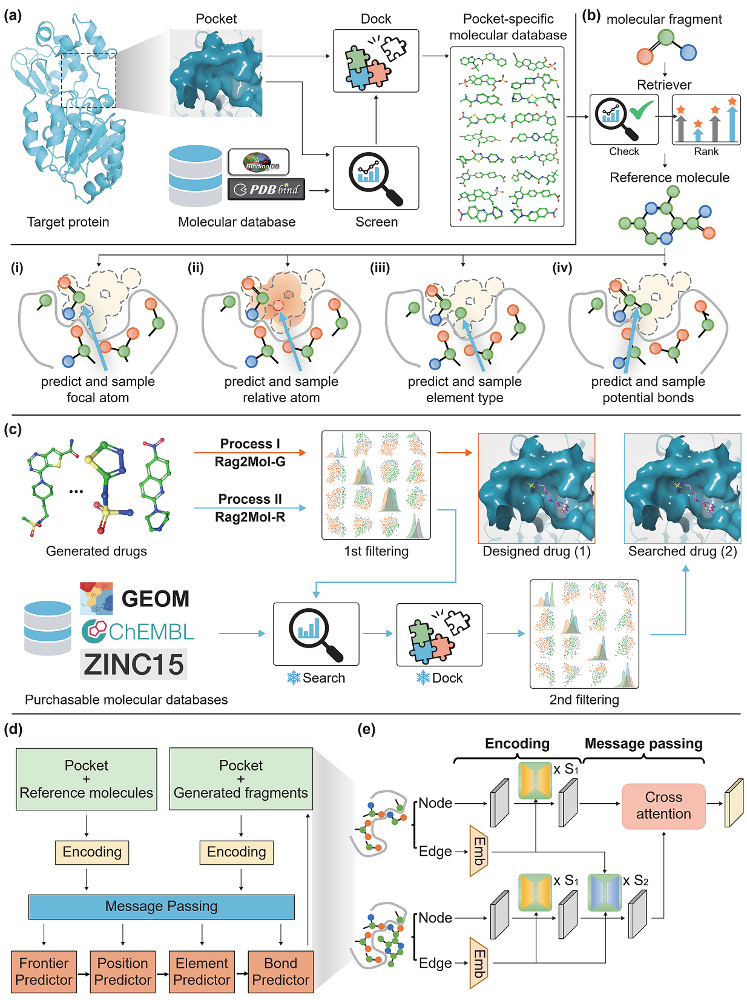

# Retrieval Augmented Structure-based Drug Design (Rag2Mol)

## About
This directory contains the code and resources of the following paper:

<i>"Structure-based drug design based on Retrieval Augmented Generation
". Under review. </i>

1. Rag2Mol is a structure-based drug design (SBDD) model using retrieval augmented generation (RAG). It uses a two-level retriever and an augmented autoregressive SBDD to generate molecule within targeting protein pocket.
2. The default network is a well-recognized GVP-based autoregressive network [1]. This software also supported user-defined network.
3. Our experimental results are based on CrossDock data. A collection of pre-processed CrossDock dataset can be obtained following (/data/README)
3. Please contact Peidong Zhang zpd24@mails.tsinghua.edu.cn if you have issues using this software.

## Overview of the Model
We introduced the Rag2Mol algorithm to address the prevalent issue of non-synthesizable compounds in SBDD models. Our solution involves retrieving reference molecules to guide the AI model for more accurate navigation within a broad search space. Additionally, by using the generated molecules as templates for similarity search, we overcome the limitations of traditional virtual screening methods.

 

### Step 1. Construct a pocket-specific database
Briefly, given target pocket, we use a pre-trained global retriever to search for small molecules with potential affinity and dock them into the pocket (Figure a). The advantage of this workflow is that the retrieved molecules have both potential interaction affinity and synthetic accessibility, implicitly assisting the AI model in learning structural knowledge and topological rules. 

### Step 2. Guide network generation based on molecular retriever
During the generation, the molecular retriever is to rank and choose reference molecule from pocket-specific database as context information (Figure b). The message-passing module would aggregate information from reference molecule to generated molecular fragment through cross-KNN graph (Figure e).

### Step 3. Screen according to preset biochemical indicators
We subject the filtered drug candidates to precise binding affinity calculations and subsequent wet-lab experiments. A set of criteria for reference: $Vina\in[−20, −5], QED\in[0.5, 2], SA\in[0.5, 2], Lipinski\in[4, 5], LogP\in[0, 4]$.

### Step 4. Similarity search based on AI-generated molecules (Rag2Mol-R)
We then randomly select representative molecule as scaffold template from each molecular cluster. Based on these templates, we search for the similar molecules within existing synthesizable compounds.

For further details, see Online Methods of our paper. 

## Sub-directories
  - [src] contains impelmentation of Rag2Mol used for the CrossDock dataset. ``train.py`` and ``sample4pdb.py`` include the training and inference of Rag2Mol, ``rag2mol_r.py`` is the function to run Rag2Mol_R.
  - [data] contains the pre-processed CrossDock data and retrieval databases which can be used to reproduce our results.

 

## Data & Parameters
  - **Data:** We provide pre-processed CrossDock dataset, which is widely used in SBDD field. This should be sufficient for reproducing our results. Please refer to [`data`](./data/README.md) for detailed explanation and download.
  - **Parameters:** We provide the paramters of pre-trained two-level retriever, and you could directly predict by correctly downloading the Rag2Mol checkpoint. Please refer to [`parameters`](./src/params/README.md) for detailed explanation and download.

**Important Note:** all data is for research-purpose only.

 

## Code Usage

Following these steps to run the code:
  1. Clone the Rag2Mol repo.
  2. Install the required packages. Please refer to [`rag2mol.yml`](./src/rag2mol.yml) and we recommend ``conda env create -f rag2mol.yml``.
  3. Download the corresponding [`data`](./data/README.md) and model [`parameters`](./src/params/README.md) and place them in the correct paths.
  2. Run `python train.py'` to train the Rag2Mol, or `taskset -c 1 python sample4pdb.py` for inference. For Rag2Mol-R, please ensure that the `results` folder has been automatically created before running `python rag2mol_r.py`.

## License
Rag2Mol is licensed under the Apache License, Version 2.0: http://www.apache.org/licenses/LICENSE-2.0

[1]. Peng, Xingang, et al. "Pocket2mol: Efficient molecular sampling based on 3d protein pockets." International Conference on Machine Learning. PMLR, 2022.

