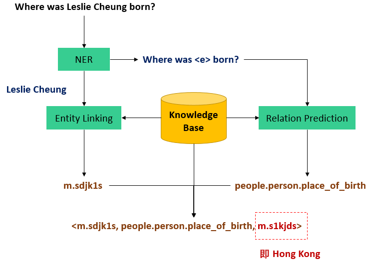
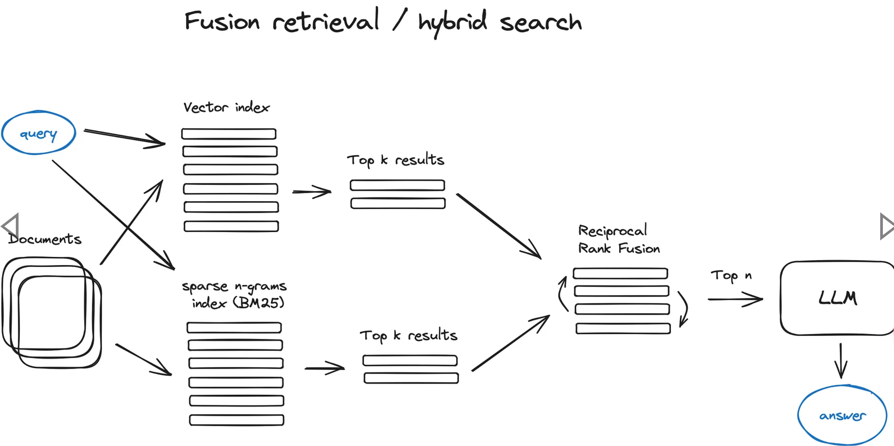
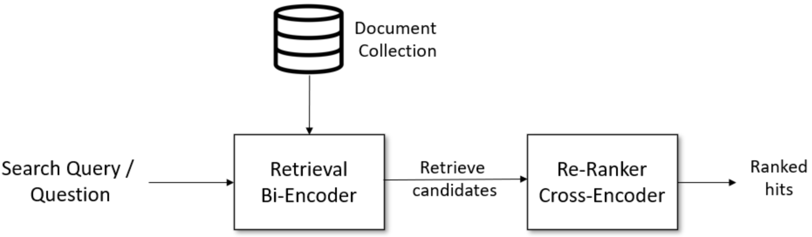

# RAG-Retrieval Augmentad Generation
* 现有模型的一些问题
    * 模型幻觉问题
    * 时效性问题
    * 数据安全问题


RAG技术结合了`大型语言模型的强大生成能力`和`检索系统的精确性`。

它允许模型在生成文本时，从外部知识库中检索相关信息，从而提高生成内容的`准确性`、`相关性`和`时效性`。

这种方法不仅增强模型的回答能力，还减少了生成错误信息的风险。

## 初始RAG

### LLM的局限性
* 虽然这些模型在`掌握大量信息`方面非常有效，但它们的结构和参数数量使得对其进行`修改`、`微调`或`重新训练`变得异常困难。
* LLM的应用往往依赖于构建适当的prompt来引导模型生成所需的文本。这种方法通过`将信息嵌入到prompt中`，从而引导模型按照特定的方向生成文本。然而，这种基于提示的方法可能`使模型过于依赖先前见过的模式`，而无法真正理解问题的本质。
* 模型幻觉（Hallucination）
    * 被定义为生成的内容与提供的源内容`无关`或`不忠实`，具体而言，是一种`虚假的感知`，但在表面上却似乎是真实的。在一般语境中，幻觉是一个心理学术语，指的是一种特定类型的感知。在自然语言处理或大型语言模型的语境下，这种感知即为一种虚假的、不符合实际的信息。
    * 造成幻觉的原因主要可以归结为`数据驱动原因`、`表示`和`解码的不完善`以及`参数知识偏见`。
    * 数据对不齐或不匹配可能导致幻觉，因为模型在训练中未能准确地理解源内容与参考内容之间的关系。
* 时效性
* 数据安全

### 知识库问答KBQA
knowledge based question answering

* 一种早期的对话系统方法，旨在利用结构化的知识库进行自然语言问题的回答。这种方法基于一个存储在`图数据库`中的知识库，通常以三元组的形式表示为`<主题，关系，对象>`，其中每个三元组都附带相关的属性信息。
* 其基于`知识图谱的结构`为系统提供了丰富的语义信息，使得系统能够`更深入`地理解用户提出的问题，并以结构化的形式回答这些问题。

#### KBQA中NLP的两种方法
* 主题识别与实体链接
    * 从识别问题中的主题开始，将其链接到知识库中的Entity。通过主题实体，系统能够在知识库中查找相关的信息并回答问题。
* 多跳查询
    * 基于图数据库的优势，通过多个关系跨越多个entity来获取更深层次的信息。这种灵活性使系统能够更全面地理解和回答用户的复杂问题。
### RAG
RAG技术在弥补LLM的局限性方面取得显著进展，尤其是在解决`幻觉问题`和`提升实效性`方面。在之前提到的LLM存在的问题中，特别是幻觉问题和时效性问题，RAG技术通过引入"外部知识库的检索机制"，有效提升生成内容的准确性、相关性和时效性。

* RAG技术通过检索外部知识库，缓解幻觉问题。相较于单纯依赖大型语言模型对海量文本数据的学习，RAG允许模型在生成文本时从事实丰富的外部知识库中检索相关信息。
* RAG技术的`时效性`优势使其在处理实效性较强的问题时更为可靠。通过与外部知识库的连接，RAG确保了模型可以获取最新的信息，及时适应当前的事件和知识。
* 与KBQA相比，RAG技术在知识检索方面更加灵活，不仅能够从"结构化"的知识库中检索信息，还能够应对"非结构化"的自然语言文本。

#### 优势
1. 准确性和相关性
2. 改善时效性，使模型适应当前事件和知识
3. 降低生成风险，依赖检索系统获得的准确信息

于是，RAG被构建为一个LLM的框架，其目标是通过结合`LLM的生成能力`和`外部知识库的检索机制`，提升NLP的效果。

RAG框架的最终输出被设计为一种`协同工作模式`，将检索到的知识融合到大型语言模型的生成过程中。在应对任务特定问题时，RAG会生成一段标准化的句子，引导大模型进行回答。
下面是RAG输出到大型语言模型的典型模板：
```txt
你是一个{task}方面的专家，请结合给定的资料，并回答最终的问题。请如实回答，如果问题在资料中找不到答案，请回答不知道。

问题：{question}

资料：
- {information1}
- {information2}
- {information3}
```
### RAG v.s. SFT
* 微调模型优势在于能够通过有监督学习的方式，通过对任务相关数据的反复迭代调整，使得模型更好地适应特定领域的知识和要求。
* RAG能够从外部知识库中检索最新、准确的信息，从而提高了答案的质量和时效性。其优势在于可以利用最新的外部信息，从而更好地适应当前事件和知识。

| **方法** | **优点** | **缺点** |
|----------|----------|----------|
| **微调模型** | 针对特定任务优化 | 更新成本高，对新信息适应性较差 |
| **RAG**       | 利用最新信息，提高答案质量，具有更好的可解释性和适应性 | 面临检索质量问题，增加额外计算资源需求 |


| **特性**           | **RAG技术**                | **SFT模型微调**         |
|---------------------|----------------------------|-------------------------|
| **知识更新**       | 实时更新检索库，无需频繁重训 | 存储静态信息，需重新训练 |
| **外部知识**       | 高效利用外部资源，适合动态数据 | 对动态数据源不够灵活     |
| **数据处理**       | 数据处理需求低             | 需高质量数据集，受限于数据 |
| **模型定制化**     | 专注信息检索和整合，定制化低 | 可定制行为、风格及领域知识 |
| **可解释性**       | 答案可追溯，解释性高       | 解释性相对较低           |
| **计算资源**       | 需要支持检索的计算资源      | 需训练数据集和微调资源   |
| **延迟要求**       | 数据检索可能增加延迟       | 微调后响应更快           |
| **减少幻觉**       | 基于实际数据，幻觉减少     | 通过特定域训练减少幻觉，但仍有限 |
| **道德和隐私**     | 需考虑外部数据隐私和道德问题 | 训练数据可能引发隐私问题 |

### RAG实现过程
`信息检索`和`LLM调用`两个关键过程。
* 信息检索通过连接外部知识库，获取与问题相关的信息。
* LLM调用则用于将这些信息整合到自然语言生成的过程中，以生成最终的回答。
1. 问题理解：准确把握用户的意图
2. 知识检索：从知识库中相关的知识检索
3. 答案生成：将检索结果与问题

### 实现中的挑战
1. 问题理解阶段，系统需要准确把握用户的意图。
    * 用户提问往往是短文本，而知识库中的信息可能是长文本。
    * 将用户提问与知识库中的知识建立有效的关联是一个难点，特别是考虑到用户提问可能模糊，用词不规范，难以直接找到相关的知识。
2. 知识检索是RAG流程中的关键步骤：
    * 用户提问可能以多种方式表达，而知识库的信息来源可能是多样的，包括PDF、PPT、Neo4j等格式。
3. 此外用户的`意图可能非常灵活`，提问、闲聊等 。
    * 在这个阶段，需要确保生成的答案与用户的意图一致，同时保持自然、连贯的文本。
    * LLM的输出可能存在幻觉问题，即生成的内容可能与问题不相关，增加了生成准确回答的难度。

### RAG for LLM: Survey
* <a href="https://arxiv.org/abs/2312.10997">Arxiv链接</a>
* <a href="./papers/2312.10997v5.pdf">查看PDF</a>

在这篇survey中，作者将RAG技术按照复杂度分为：Naive RAG，Advanced RAG、Modular RAG
* Naive RAG：最基本形式，也被称为经典RAG。包括`索引`、`检索`、`生成`三个基本步骤。
    * 索引阶段将文档库分割成短的Chunk，并构建向量索引。
    * 检索阶段根据问题和Chunks的相似度检索相关文档片段。
    * 生成阶段以检索到的上下文为条件，生成问题的回答。
* Advanced RAG：在Naive RAG的基础上进行优化和增强。包含额外处理步骤，分别在`数据索引`、`检索前`和`检索后`进行。
    * 更精细的`数据清洗`、`设计文档结构`和`添加元数据`，以提升文本一致性、准确性和检索效率。
    * 在`检索前`使用**问题的重写**、**路由和扩充**等方式`对齐问题和文档块之间的语义差异`。
    * 在`检索`后通过`重排序`避免“Lost in the Middle”现象，或通过`上下文筛选`与`压缩缩短窗口长度`。
    * 
* Modular RAG：引入更多具体功能模块，例如查询搜索引擎、融合多个回答等。
    * 技术上融合了`检索`与`微调`、`强化学习`等。
    * 流程上对RAG模块进行设计和编排，出现多种不同RAG模式。
    * 提供更大灵活性，系统可以根据应用需求选择合适的功能模块组合。
    * 模块化RAG的引入使得系统更自由、灵活，适应不同场景和需求。

### RAG多个关键模块
* 意图理解：负责准确`把握用户提出的问题`，确定用户的意图和主题。处理用户提问的模糊性和不规范性，为后续流程提供清晰的任务目标。
* 文档解析：用于`处理来自不同来源的文档`，包括PDF、PPT、Neo4j等格式。该模块负责将文档内容转化为可处理的结构化形式，为知识检索提供合适的输入。
* 文档索引：将解析后的文档`分割成短的Chunk，并构建向量索引`。或通过全文索引进行文本检索，使得系统能够更快速地找到与用户问题相关的文档片段。
* 向量嵌入：将文档索引中的`内容映射为向量表示，以便后续的相似度计算`。这有助于模型更好地理解文档之间的关系，提高知识检索的准确性。
* 知识检索：根据`用户提问`和`向量嵌入`计算的相似度检索或文本检索打分。这一步骤需要解决问题和文档之间的语义关联，确保检索的准确性。
* 重排序：在知识检索后`对文档库进行重排序`，以避免“Lost in the Middle”现象，确保最相关的文档片段在前面。
* 大模型回答：利用LLM生成最终的回答。该模块结合检索到的上下文，以生成连贯、准确的文本回答。
* 其他功能模块：可根据具体应用需求引入其他功能模块，如`查询搜索引擎`、`融合多个回答`等。模块化设计使得系统更加灵活，能够根据不同场景选择合适的功能模块组合。

## ChatGLM/GLM API使用
## 读取数据
## 文本索引与答案检索
### 文本检索
核心是构建`倒排索引`以实现高效的文本检索
1. `文本预处理`：
    * 对原始文本进行清理和规范化，包括去除停用词、标点符号等噪声，并将文本统一转为小写。
    * 采用`词干化`或`词形还原`等技术，将单词转换为基本形式，以减少词汇的多样性，为后续建立索引做准备。
2. `文本索引`：
    * 通过对文档集合进行`分词`，得到每个文档的词项列表，并为每个词项构建倒排列表，记录包含该词项的文档及其位置信息。
    * 这种结构使得在查询时能够快速`找到包含查询词的文档`，为后续的文本检索奠定了基础。
3. `文本检索`：
    * 查询处理阶段，用户查询经过预处理后，与建立的倒排索引进行匹配。
    * 计算查询中每个词项的权重，并利用检索算法（如TFIDF或BM25）对文档进行排序，将相关性较高的文档排在前面。

### 文本检索与语义检索
| **特性**          | **文本检索**                                | **语义检索**                           |
|--------------------|--------------------------------------------|----------------------------------------|
| **定义**          | 通过关键词或短语匹配文本数据的过程 | 强调理解查询与文本之间的深层语义关系 |
| **方法**          | 基于关键词匹配，使用TFIDF、BM25等权重计算 | 使用NLP技术，如词嵌入、预训练语言模型 |
| **特点**          | 强调字面意义，关注表面文本的匹配 | 关注词语之间的关联、语境和含义 |
| **应用场景**      | 大规模文本数据的快速匹配  | 对语义理解要求较高的场景 |
| **优势**          | 处理速度较快，适用于大规模文本数据 | 能处理一词多义、近义词等语义复杂情况 |


| **联系** | **描述**  |
|----------|-------------|
| **结合使用** | 先使用文本检索筛选出候选文档，然后在这些文档上应用语义检索。                                  |
| **相互增强** | 可以利用语义模型提取关键词的上下文信息，提升检索效果。                                        |
### TFIDF(Term Frequency-Inverse Document Frequency)
一种用于信息检索和文本挖掘的常用权重计算方法，旨在衡量`一个词项`对于`一个文档集合中某个文档`的重要性。该方法结合了两个方面的信息：
* 词项在文档中的频率（TF）
$$
TF(t, d) = \frac{词项t在文档d中出现的次数}{文档d中所有词项的总数}
$$
表示一个词项在文档中的想对频率
* 在整个文档集合中的逆文档频率（IDF）。
$$
IDF(t) = log(\frac{文档集合中的文档总数}{包含词项t的文档数 + 1})
$$
表示一个词项在文档集合中的稀有长度
* TFIDF = TF * IDF
$$
TFIDF(t, d, D) = TF(t, d) \times IDF(t)
$$
### BM25
BM25Okapi是BM25算法的一种变体，在信息检索中用于评估`文档`与`查询`之间的相关性。

* 主要参数：
    * $k_1$：控制词项频率对分数的影响，通常设置为1.5。
    * $b$：控制文档长度对分数的影响，通常设置为0.75。文档长度越长，该项分数越小
    * $\epsilon$：用于防止逆文档频率（IDF）为负值的情况，通常设置为0.25。

$$
score = \Sigma_{q \in Query}\big( IDF(q) \cdot \frac{q_{freq} \cdot (k_1 + 1)}{q_{freq} + k_1 \cdot (1 - b + b \cdot \frac{doc\_len}{avgdl})} \big)
$$

### 工业级考虑
* 实现非工业级别：
    * 在实际进行文本检索时，特别是在大规模数据集和生产环境中，应该使用专业的文本检索引擎工具，例如`Elasticsearch`，以确保高效、可扩展和内存友好的实现。

* 相似度计算的内存和数据量级考虑：
    * 在实际应用中，对整个文本集合构建矩阵并进行相似度计算可能导致内存占用较大，尤其在大规模数据集情况下。
    * 建议考虑使用基于倒排索引等数据结构的文本检索引擎，以减小内存占用并提高检索效率。

* 停用词和单词筛选：
    * 未对文本进行停用词筛选和额外的单词筛选。
    * 在实际应用中，建议`进行停用词的去除`，以排除常见但无实际意义的词汇，提高检索的准确性。
    * 同时，考虑引入领域专有的单词筛选，以过滤掉与任务无关的词汇，优化检索结果。

* PDF处理方式：
    * 将PDF内每一页都当做一个文档进行处理。
    * 实际应用中，对于PDF文档，可以考虑使用专业的PDF文本提取工具，提取有意义的文本内容，而不是将每一页都当做独立的文档处理。这有助于更好地利用文档内部的语义信息。

### 文本嵌入与向量检索
#### 语义检索流程
* 通过词嵌入和句子嵌入等技术，将文本表示为语义丰富的向量。
* 通过相似度计算和结果排序找到最相关的文档。
* 用户查询经过自然语言处理处理，最终系统返回经过排序的相关文档，提供用户友好的信息展示。
* 语义检索通过深度学习和自然语言处理技术，使得系统能够更准确地理解用户查询，提高检索的准确性和效果。


#### 文本编码模型
对于语义检索的精度至关重要。
* 目前，大多数语义检索系统采用预训练模型进行文本编码，其中最为常见的是基于BERT的模型，或者使用GPT等。这些预训练模型通过在大规模语料上进行训练，能够捕捉词语和句子之间的复杂语义关系。
* 选择合适的文本编码模型直接影响到得到的文本向量的有效性，进而影响检索的准确性和效果。

#### 文本切分方法
* 文本的长度是另一个关键因素，影响了文本编码的结果。
* 短文本和长文本在编码成向量时可能表达不同的语义信息。
    * 即使两者包含相同的单词或有相似的语义，由于上下文的不同，得到的向量也会有所不同。
    * 因此，当在语义检索中`使用短文本来检索长文本`时，或者反之，`可能导致一定的误差`。
* 针对文本长度的差异，有些系统采用截断或填充等方式处理，以保持一致的向量表示。

| **名称**            | **分割依据**                | **描述**                                                                                           |
|---------------------|----------------------------|---------------------------------------------------------------------------------------------------|
| **递归式分割器**     | 一组用户定义的字符          | 递归地分割文本，尽量保持相关文本段落相邻。推荐作为开始文本分割的方式 |
| **HTML分割器**       | HTML特定字符               | 基于HTML特定字符进行分割，并添加有关每个文本块来源的信息（基于HTML结构）|
| **Markdown分割器**   | Markdown特定字符           | 基于Markdown特定字符进行分割，并添加有关每个文本块来源的信息（基于Markdown结构） |
| **代码分割器**       | 代码（Python、JS）特定字符 | 基于编码语言的特定字符进行分割，支持15种不同的编程语言 |
| **Token分割器**      | Tokens | 基于Token进行分割，提供多种Token计量方法。推荐用于自然语言处理 |
| **字符分割器**       | 用户定义的字符 | 基于用户定义的字符进行分割，较为简单的分割方式之一 |
| **语义分块器**       | 句子 | 首先按句子分割，再将语义相似的相邻句子组合在一起|

* Chunk Size：将文本划分为较小块的大小，表示分割后每个独立文本块的长度或容量，依据具体应用需求选择适合的大小。
* Overlap Size：相邻文本块之间的重叠部分大小，用于保留上下文信息，控制文本切分时的上下文保留程度。

## 文本多路召回与重排序
### 多路召回逻辑
* 召回：指在搜索或推荐任务中，从一个大规模的数据库或候选池中筛选出可能相关的结果，以形成一个候选集合供进一步处理或排序。
* 通过多个召回路径（或方法）综合获取候选文档，以提高检索的全面性和准确性。
* 单一的召回方法可能由于模型特性或数据特点而存在局限性，多路召回逻辑引入了多个召回路径，每个路径采用不同的召回方法。

#### 实现方法
1. 将`BM25的检索结果`和`语义检索结果`按照排名进行加权
2. 按照`段落、句子、页`不同的角度进行语义编码进行检索，综合得到检索结果。


### 重排序逻辑
* 文本检索领域中一种重要的策略，主要用于`优化原有文本检索方法返回的候选文档顺序`，以提高最终的检索效果。
* 在传统的文本检索方法中，往往采用`打分`的逻辑，如`计算BERT嵌入向量之间的相似度`。
* 而重排序逻辑引入了更为复杂的`文本交叉方法`，通过特征交叉得到更进一步的打分，从而提高排序的准确性。


* 重排序逻辑常常使用更为强大的模型，如交叉编码器（cross-encoder）模型。这类模型能够更好地理解文本之间的交叉关系，捕捉更复杂的语义信息。
* 首先通过传统的嵌入模型获取初始的Top-k文档，然后使用重排序逻辑对这些文档进行重新排序。这样可以在保留初步筛选文档的基础上，更精确地排列它们的顺序。

## 文本问答Prompt优化
## 问答意图识别
### 文本相似度
1. 提取用户提问的嵌入向量
2. 提取文档所有的嵌入向量
3. 判断提问向量与文档向量的最低相似度，结合相似度大小进行判断

### Prompt意图识别

## 问答关键词提取
NLP领域的一项重要任务，其目标是从给定的文本中提取出最具代表性和有意义的单词或短语。这些关键词通常反映了文本的主题、内容或重要信息。常见的步骤包括`分词`、`词性标注`、`停用词移除`、`计算词语权重`以及`关键词抽取算法`等过程。

### 方法
1. IDF
    1. 分词（Tokenization）： 将文本拆分为单词或短语。这一步骤将文本转换为基本的语言单元，为后续的处理做准备。
    2. 移除通用词（Stopword Removal）： 剔除常见的停用词，如"and"、“the”、"is"等，这些词在文本中普遍出现但往往没有实际的信息价值。这样做可以减少噪音，使关键词更集中在文本的内容性词汇上。
    3. 计算逆文档频率（IDF）： 对于每个单词，计算其逆文档频率。逆文档频率是一个衡量单词重要性的指标，它通过对整个文本集合中包含该词的文档数取倒数来计算。
    4. 计算TF-IDF得分： 对于每个单词，计算其TF-IDF得分，即词频（TF）与逆文档频率（IDF）的乘积。TF表示单词在当前文档中的出现频率。
    5. 排序和选取关键词： 根据计算得到的TF-IDF得分对单词进行排序，选择排名前几的单词作为关键词。排名越高的单词表示在当前文档中具有更高的重要性。

2. KeyBERT
    1. Embedding文本： 首先，KEYBERT使用预训练的BERT模型，例如distilbert-base-nli-mean-tokens，将输入的文本嵌入到一个高维的向量空间中。BERT模型能够学习丰富的语义表示，因此生成的向量能够捕捉文本的语义信息。
    2. 计算余弦相似度： 然后，KEYBERT计算文档中每个候选关键词或关键短语与整个文档之间的余弦相似度。余弦相似度是一种衡量两个向量之间夹角的度量，它在这里用于度量嵌入向量之间的相似性。
    3. 排序关键词： 最后，根据计算得到的余弦相似度值，KEYBERT将关键词或关键短语排序，从而形成最终的关键词列表。余弦相似度越高，表示关键词与文档的语义相似度越大，因此在排序中位置越靠前。

3. Prompt关键词提取
    1. 将所有文档通过预训练的嵌入模型映射到向量空间中，生成它们的向量表示。
    2. 通过计算文档之间的相似性，使用余弦相似度等度量方法，将相似的文档聚合成一个文档聚类。
    3. 在每个文档聚类中，选择一个代表性文档，利用关键词提取模型生成关键词。


## 扩展词与扩展搜索
查询改写（Query Rewriting，或称为查询扩展Query Expansion）。`对原始Query拓展出与用户需求关联度高的改写词`，多个改写词与用户搜索词一起做检索，从而用更好的表述，帮用户搜到更多符合要求的文本。
* 语义拓展：主要是同义词、下位词以及常见的大小写数字和繁简转化等，例如“理发”、“剪发”、“造型”、“发艺”、“美发”、“剪头”等等。
* 用户表达和商家表达上的Gap：非语言上的同义。如用户表述口语化“学吉他”，商户描述书面化“吉他培训”；用户输入不完全匹配商户名：“希尔顿大酒店”（商家更常见的描述为“希尔顿酒店”）。
* 场景拓展：例如“摘草莓”在美团的搜索场景下，用户基于对平台的认知对应需求是“草莓园”。
* 其他漏召回问题：部分的多字少字、纠错等问题，如“房屋扫”对应“家政保洁”的需求；理论上查询改写可以通过增加改写词解决所有漏召回问题，诸如“冬日四件套”包括“冰糖葫芦、烤地瓜、炒栗子、热奶茶”这类有时效性的网红概念，也可以通过改写进行解决。

方法：通过词向量找到同义词 / 通过大模型生成扩展句